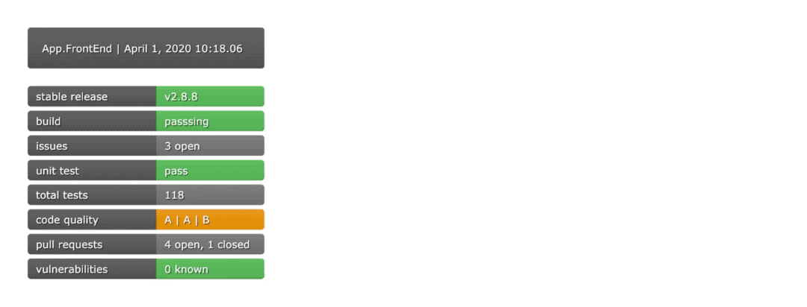

# GoBadge

GoBadge is an open source project for displaying information via SVG "badges". GoBadge was inspired by the open source project, **[shields.io](https://shields.io)**, however, this project was developed to solve for one of shields.io's biggest flaws: the one badge per URL limit. GoBadge was engineered specifically for SVG dashboarding, which means that just one URL can dynamically generate a table-style dashboard of SVG badges.

&nbsp;

Dashboards can by dynamically configured to fit your perfect look.



---

## Getting Started

```bash
go get github.com/medenzon/gobadge
```

```go
package main

import (
    "github.com/medenzon/gobadge"
)
```